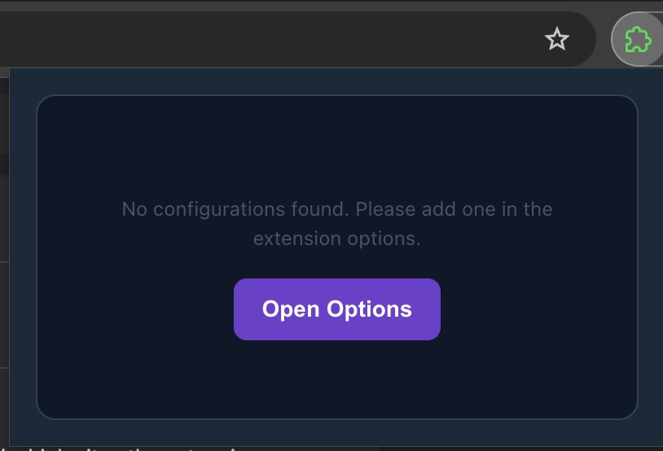
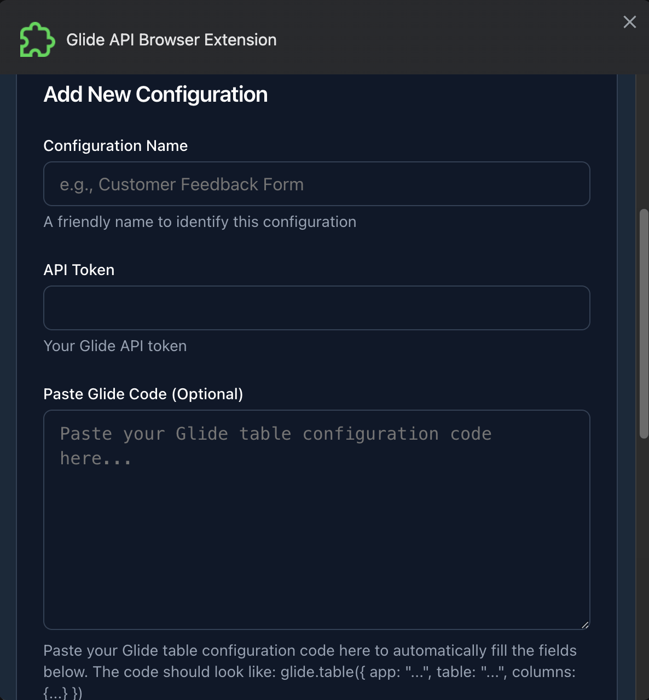
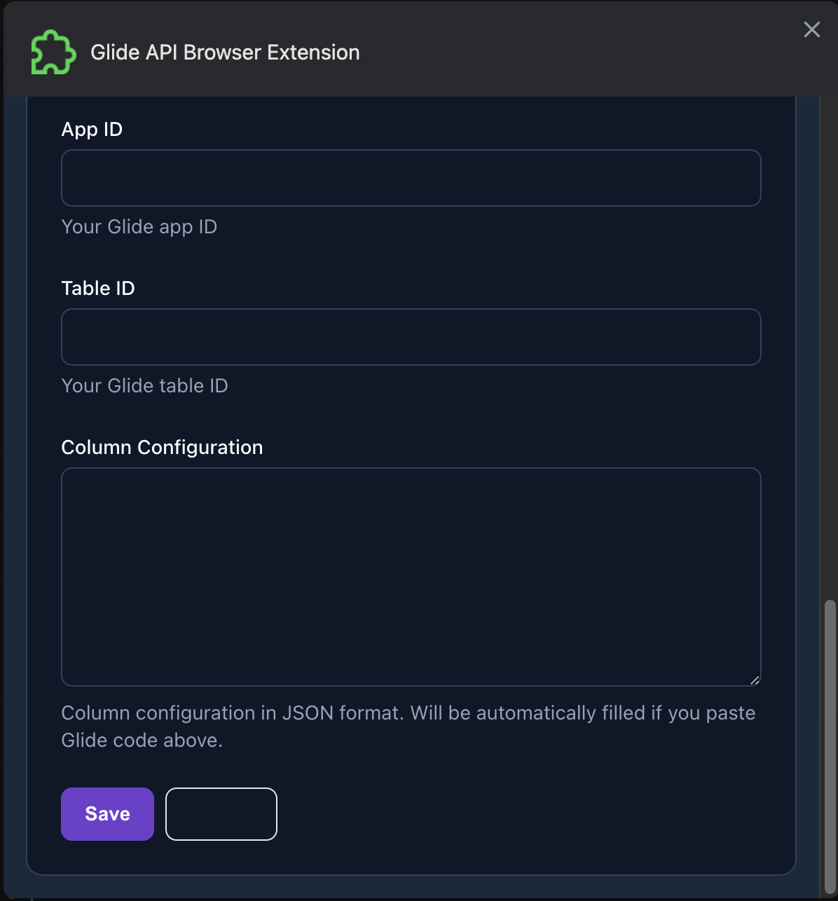
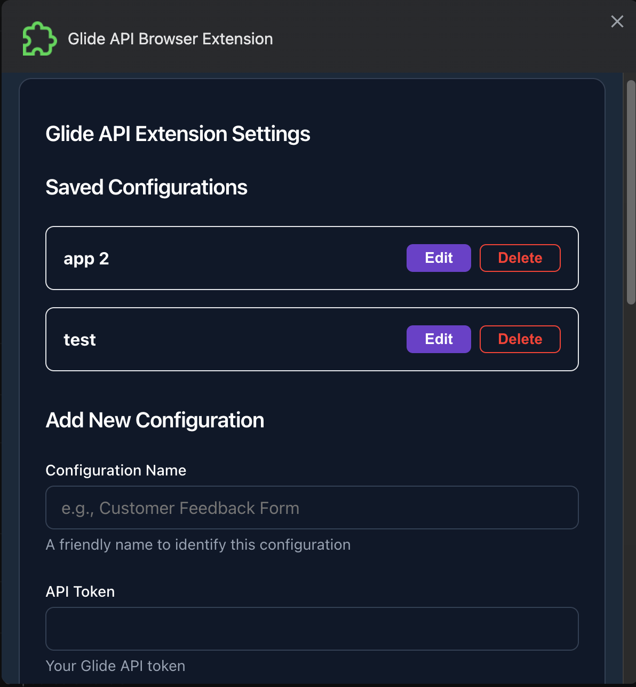
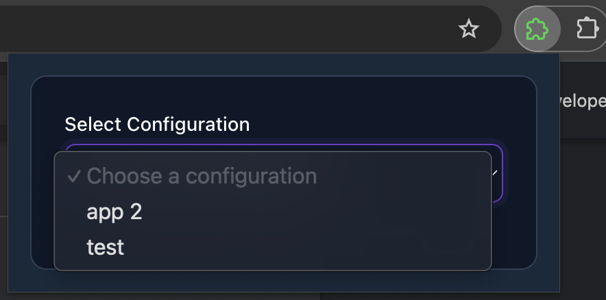
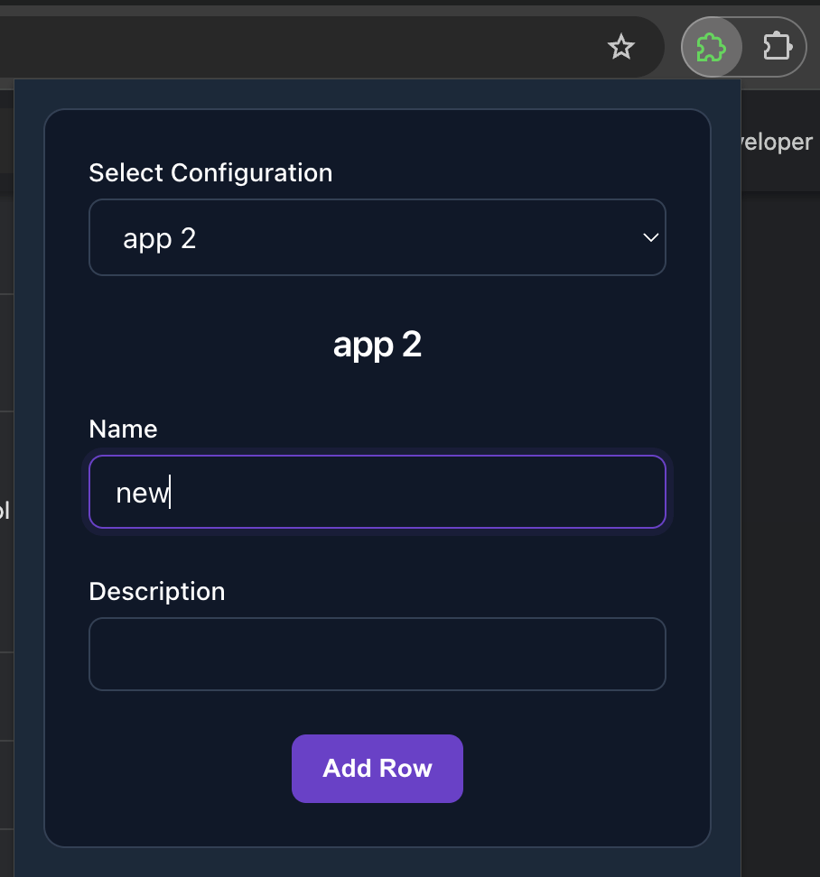
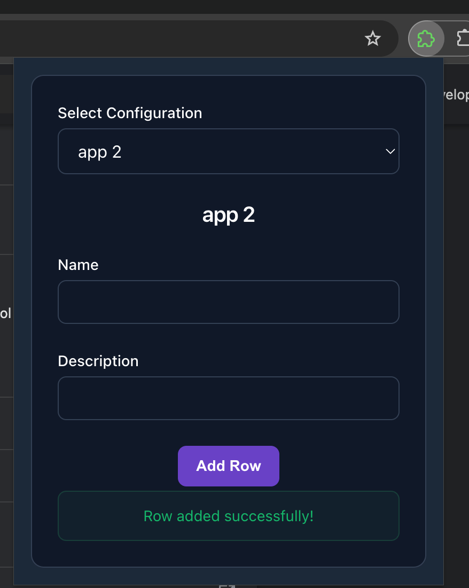
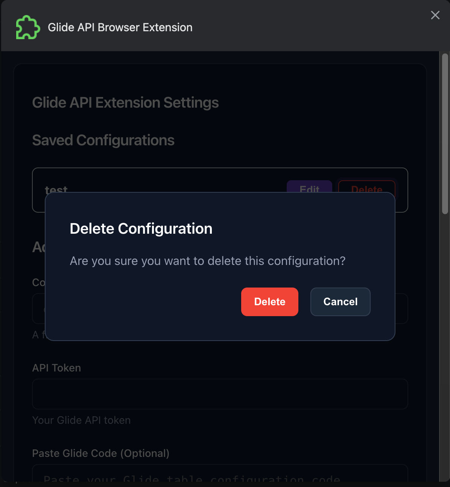

# Glide API Browser Extension Starter

A browser extension that allows you to easily add rows to your Glide tables directly from your browser.

## Getting Started with this Template

1. Click the "Use this template" button above
2. Clone your new repository
3. Navigate to the `src` directory:
```bash
cd src
```
4. Install dependencies:
```bash
pnpm install
```
5. Start the development server:
```bash
pnpm dev
```

The extension will be loaded in development mode. You can now make changes to the code and see them reflected in real-time.

## Features

- Add rows to Glide tables with a simple form interface
- Save multiple table configurations
- Parse Glide table configuration code automatically
- Secure storage of API tokens

## Usage Guide

### First Time Setup

When you first open the extension, you'll see the welcome screen:



Click "Open Options" to configure your Glide tables.

### Adding Table Configurations

In the options page, you can add new table configurations:



Fill in your API configuration details:



You can add multiple configurations for different tables:



### Using the Extension

1. Click the extension icon and choose your configuration:



2. The form will be automatically created based on your table structure:



3. Fill in the form and submit. You'll see a success message when the row is added:



### Managing Configurations

You can delete configurations you no longer need:



## Setup

1. Navigate to the `src` directory:
```bash
cd src
```

2. Install dependencies:
```bash
pnpm install
```

3. Run the development server:
```bash
# For Chrome/Edge/Chromium browsers
pnpm dev
```

(Support for Firefox coming soon, I haven't had a chance to test it yet)

## Development

This extension is built using:
- [WXT](https://wxt.dev) - Modern browser extension framework
- Vue.js - UI framework
- @glideapps/tables - Official Glide Tables SDK

If you want to avoid having to re-enter the configruation details in the development environment, you can create a file in the `src` directory called `web-ext.config.ts` with the following content:
```ts

import { defineRunnerConfig } from 'wxt';

export default defineRunnerConfig({
    chromiumArgs: ['--user-data-dir=./.wxt/chrome-data'],
});
```

This will create a Chrome profile and use it for development. Which will preserve your extension options data even if you start or stop the development server. (huge time saver!)

## Build

To build the extension for production, from the `src` directory:
```bash
# For Chrome/Edge/Chromium browsers
pnpm build
```

The built extension will be in the `.output` directory.

## Project Structure

```
src/
├── entrypoints/       # Extension entry points (popup, options, background)
├── components/        # Shared Vue components
├── lib/              # Shared utilities
├── assets/           # Static assets
├── styles/           # Global styles
└── wxt.config.ts     # WXT configuration
```

## Contributing

1. Fork the repository
2. Create a feature branch
3. Commit your changes
4. Push to the branch
5. Open a Pull Request

## License

MIT License - feel free to modify and share!

## Support

- Report issues on GitHub
- Check out the [Glide API documentation](https://docs.glideapps.com/reference/api-introduction)
- Visit [WXT documentation](https://wxt.dev) for extension development help
